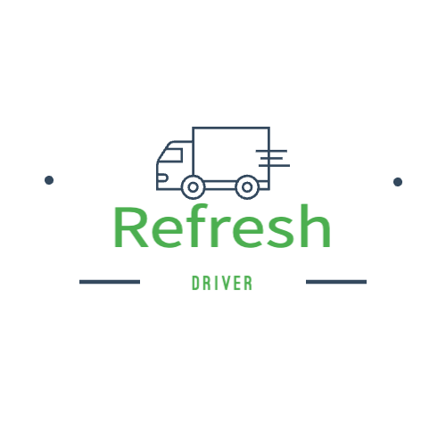

<h1 align="center">Refresh Driver APP</h1>

  
  <h2>지구를 다시 새로고침 때까지, 새로고침</h2>

## 📱 프로젝트 소개

**Refresh Driver APP**은 폐기물 수거 기사님들을 위한 전문적인 업무 관리 애플리케이션입니다. 기존 웹 서비스 <a href="https://refresh-f5.store" target="_blank">https://refresh-f5.store</a>와 연동되어, 수거 기사들이 보다 체계적이고 효율적으로 업무를 수행할 수 있도록 설계되었습니다.

본 앱은 실시간 경로 최적화, 수거 일정 관리, 수거량 추적 등의 핵심 기능을 제공하여 수거 과정의 효율성을 극대화하고, 폐기물 관리 업무의 디지털 전환을 선도합니다.

## 🌟 주요 기능

### 📍 지도 기반 수거지 관리
- **실시간 수거지 위치 확인**: 모든 수거지를 한눈에 볼 수 있는 지도 인터페이스
- **지역별 필터링**: 구별, 시간대별 수거지 분류 및 검색
- **수거 상태 관리**: 완료/미완료 상태 실시간 업데이트

### 🚚 스마트 경로 최적화
- **최적 경로 자동 생성**: 카카오 모빌리티 API 기반 최단시간, 최단거리 경로 계산
- **자동 수거지 선택**: 현재 위치 기반 가장 효율적인 수거지 5곳 자동 선택
- **실시간 경로 재조정**: 교통상황 및 수거 완료에 따른 동적 경로 업데이트

### 🗺️ 내비게이션 연동
- **카카오맵 기반 내비게이션**: 원터치 내비게이션 실행
- **순차적 경로 안내**: 선택된 수거지 순서대로 자동 안내
- **음성 안내 지원**: 운전 중 안전한 음성 가이드

### 📊 업무 관리 시스템
- **수거 일정 관리**: 시간대별 수거 계획 수립 및 관리

## 👨‍💻 개발팀

| 이름 | [서동섭](https://github.com/dongsubnambuk) | [손경락](https://github.com/ganglike248) | [한동균](https://github.com/hdg5639) |
| :-: | :-: | :-: | :-: |
| 프로필 |  |  |  |
| 기술 스택 |  |  |  |
| 담당 역할 |전반적인 앱 제작 | 네비게이션 리펙터링 | **백엔드 개발**   서버 API 개발 |

## ⭐ 주요 기능 소개

| 🔧 **기능** | 📝 **설명** | 📸 **이미지** |
|:---:|:---|:---:|
| **🏠로그인** | 수거 기사 전용 로그인 |  |
| **💰 당일 수거지 리스트** | 당일 수거지 리스트 확인 |  |
| **📋 지역필터링** | 구별로 지역 필터링 및 거리/시간 필터링 |  |
| **🛒 위치필터링** | 현재 위치 기반으로 해당 구 필터링 |  |
| **💳 폐기물 상세 정보** | 신청자 폐기물 상세 내역 조회 |  |
| **📊 지도** | 추천거리, 최단거리, 최단시간 경로 확인 |  |
| **📊 네비게이션 연동** | 카카오맵 네비게이션 연동 |  |
| **📊 경유지 자동 시작** | 수거 종료 후 카카오맵에서 본 앱으로 복귀시 자동으로 다음 경유지 안내 |  |

  <strong>🌱 지속 가능한 미래를 위한 스마트 폐기물 관리</strong> 
  © 2025 TEAM_F5. All Rights Reserved.

