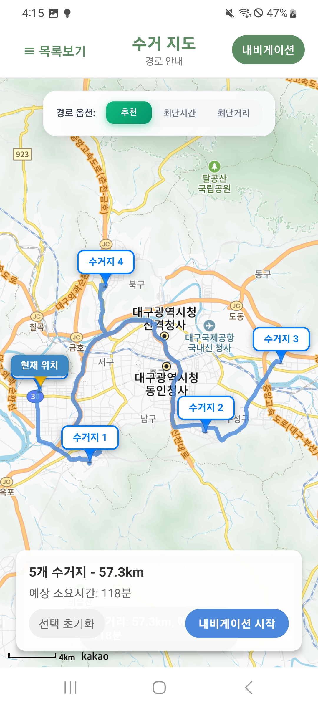

# 🚛 Refresh Driver APP

### 🌍 *지구를 다시 새로고침 때까지, 새로고침*

## 📱 프로젝트 소개

> **폐기물 수거 기사님들을 위한 차세대 업무 관리 솔루션**

**Refresh Driver APP**은 웹 서비스 [**refresh-f5.store**](https://refresh-f5.store)와 연동되어, 수거 기사님들이 폐기물 수거 업무의 효율을 높이기 위한 애플리케이션입니다.

## 🌟 핵심 기능

### 🎯 **주요 특징**

<table align="center">
<tr>
<td align="center" width="33%">

**📍 지도 기반 관리**
- 실시간 수거지 위치 확인
- 지역별 스마트 필터링
- 수거 상태 실시간 업데이트

</td>
<td align="center" width="33%">

**🚚 경로 최적화**
- 카카오 모빌리티 API 연동
- 자동 수거지 선택 (5곳)
- 동적 경로 재조정

</td>
<td align="center" width="33%">

**🗺️ 네비게이션**
- 원터치 카카오맵 실행
- 순차적 경로 안내
- 음성 가이드 지원

</td>
</tr>
</table>

## 👨‍💻 개발팀

<table>
<tr>
<th align="center" style="background-color: #f8fafc; padding: 20px; border: 1px solid #e2e8f0;">
<h4 style="margin: 0; color: #7c3aed;">📱 Mobile Developer(Lead)</h4>
</th>
<th align="center" style="background-color: #f8fafc; padding: 20px; border: 1px solid #e2e8f0;">
<h4 style="margin: 0; color: #7c3aed;">📱 Mobile Developer</h4>
</th>
<th align="center" style="background-color: #f8fafc; padding: 20px; border: 1px solid #e2e8f0;">
<h4 style="margin: 0; color: #2563eb;">🎨 Frontend Developer</h4>
</th>
<th align="center" style="background-color: #f8fafc; padding: 20px; border: 1px solid #e2e8f0;">
<h4 style="margin: 0; color: #059669;">⚙️ Backend Developer</h4>
</th>
</tr>
<tr>
<td align="center" style="padding: 30px 20px; border: 1px solid #e2e8f0;">
 
<h3 style="margin: 0 0 10px 0; color: faf5ffb; font-size: 20px;"><strong>서동섭</strong></h3>
  
  

<small style="color: #6b21a8; font-weight: 500;">전반적인 앱 제작</small>

</td>
<td align="center" style="padding: 30px 20px; border: 1px solid #e2e8f0;">
 
<h3 style="margin: 0 0 10px 0; color: #faf5ff; font-size: 20px;"><strong>손경락</strong></h3>
  
  

<small style="color: #6b21a8; font-weight: 500;">네비게이션 리팩터링   수거지 관리 CSS 수정</small>

</td>
<td align="center" style="padding: 30px 20px; border: 1px solid #e2e8f0;">
 
<h3 style="margin: 0 0 10px 0; color: #faf5ff; font-size: 20px;"><strong>김채원</strong></h3>
  
  

<small style="color: #1e40af; font-weight: 500;">당일 수거지 관리 초기 CSS 수정</small>

</td>
<td align="center" style="padding: 30px 20px; border: 1px solid #e2e8f0;">
 
<h3 style="margin: 0 0 10px 0; color: #faf5ff; font-size: 20px;"><strong>한동균</strong></h3>
  
  

<small style="color: #065f46; font-weight: 500;">서버 API 개발</small>

</td>
</tr>
</table>

## ✨ 주요 기능 소개

### 🔐 **로그인 시스템**

  
<i>수거 기사 전용 로그인 시스템</i>

---

### 📋 **당일 수거지 관리**

  
<i>오늘 수거해야 할 폐기물을 한눈에 확인</i>

---

### 🔍 **스마트 필터링**

  
<i>구별 지역 및 거리/시간 기준 필터링</i>

---

### 📍 **위치 기반 서비스**

  
<i>GPS 기반 현재 위치 주변 수거지 자동 표시</i>

---

### 📄 **폐기물 상세 정보**

  
<i>수거 신청자 폐기물 상세 정보 </i>

---

### 🗺️ **경로 최적화**

  
<i>추천거리 · 최단거리 · 최단시간 옵션</i>

---

### 🚀 **수거 작업 시작**

  
<i>선택한 최적 경로로 원터치 시작</i>

---

### 🧭 **카카오맵 연동**

  
<i>카카오 맵 실행</i>

---

### 🔄 **스마트 자동 안내**

  
<i>수거 완료 → 앱 복귀 → 다음 수거지 자동 안내</i>

---

© 2025 TEAM_F5. All Rights Reserved.

